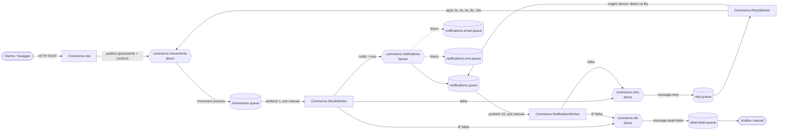
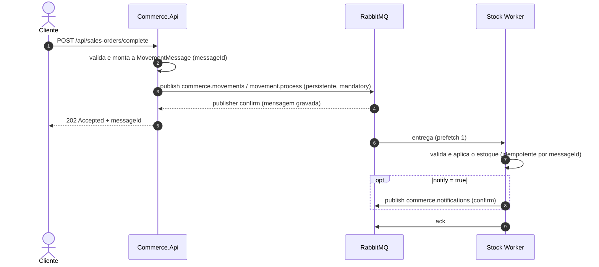
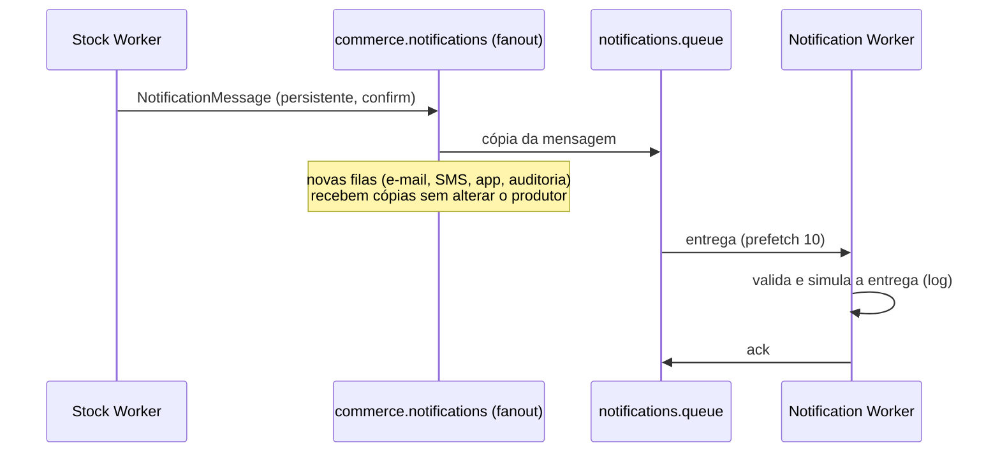
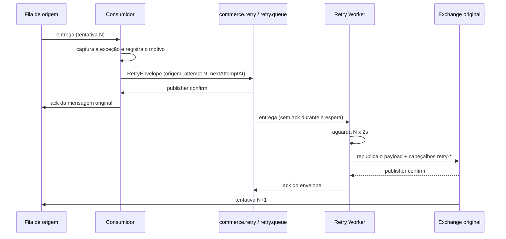
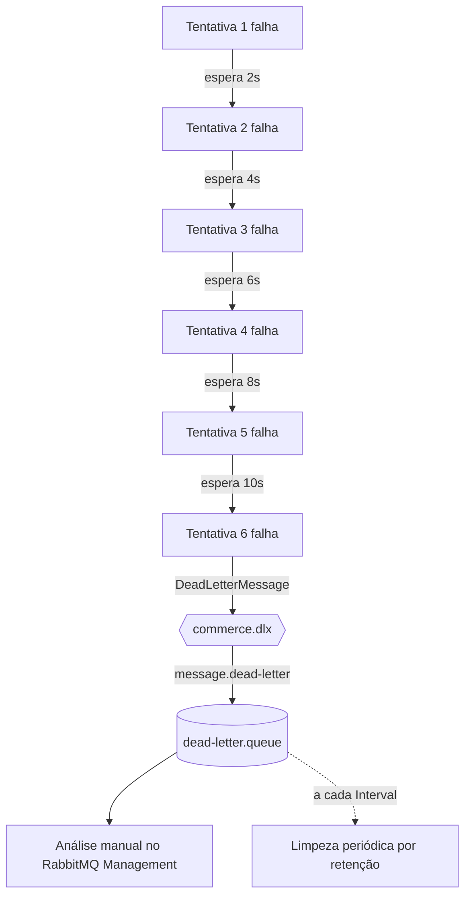

# Commerce Messaging — mensageria com RabbitMQ para e-commerce

Sistema distribuído em **C# / .NET 8** que demonstra comunicação assíncrona com **RabbitMQ** em um cenário de comércio eletrônico: movimentações de estoque (point-to-point), notificações (publish/subscribe), **retry com atraso progressivo** e **Dead Letter Queue** (o documento original chama de DQL; aqui está implementada como DLQ).

| Tecnologia | Versão |
|---|---|
| .NET / ASP.NET Core Web API | 8.0 |
| RabbitMQ (Docker, com Management Plugin) | 4.3 |
| RabbitMQ.Client | 7.2.2 (API assíncrona) |
| Swashbuckle (Swagger) | 10.2.3 |
| xUnit | 2.9.3 |

## Sumário

1. [Contexto e problema](#1-contexto-e-problema)
2. [Arquitetura](#2-arquitetura)
3. [Componentes](#3-componentes)
4. [Exchanges, filas e bindings](#4-exchanges-filas-e-bindings)
5. [Fluxos](#5-fluxos)
6. [Retry](#6-retry)
7. [Dead Letter Queue](#7-dead-letter-queue-dqldlq)
8. [Confiabilidade e tolerância a falhas](#8-confiabilidade-e-tolerância-a-falhas)
9. [Escalabilidade e ordenação](#9-escalabilidade-e-ordenação)
10. [Segurança](#10-segurança)
11. [Como executar](#11-como-executar)
12. [Exemplos de requisições](#12-exemplos-de-requisições)
13. [Exemplos de mensagens](#13-exemplos-de-mensagens)
14. [Como simular falhas](#14-como-simular-falhas)
15. [RabbitMQ Management](#15-como-visualizar-no-rabbitmq-management)
16. [Observabilidade](#16-observabilidade)
17. [Testes](#17-testes)
18. [Decisões arquiteturais](#18-decisões-arquiteturais)
19. [Limitações conhecidas e próximos passos](#19-limitações-conhecidas-e-próximos-passos)

---

## 1. Contexto e problema

Em um e-commerce, concluir um pedido de venda ou registrar a entrada de uma compra dispara uma rotina de estoque que pode ser lenta (acesso a banco, cálculos, integrações) e falhar por motivos temporários. Se a API executasse essa rotina dentro da requisição HTTP:

- o usuário ficaria esperando o processamento pesado terminar;
- uma falha momentânea do estoque derrubaria a operação inteira;
- picos de pedidos sobrecarregariam o estoque no mesmo ritmo das requisições;
- cada novo interessado no evento (e-mail, SMS, auditoria) exigiria mudar a API.

**O que a mensageria resolve:** a API apenas registra a intenção como uma mensagem persistente no RabbitMQ e responde **202 Accepted** com um `messageId`. O processamento acontece de forma assíncrona nos workers, que absorvem picos (a fila funciona como buffer), tentam de novo em falhas temporárias e isolam na DLQ o que não pode ser processado — sem perder mensagens.

## 2. Arquitetura



### Estrutura do projeto

```
├── docker-compose.yml              RabbitMQ + Management (credenciais via .env)
├── .env.example                    modelo das credenciais (o .env real fica fora do Git)
├── rabbitmq/rabbitmq.conf          configuração do broker (guest restrito, TLS opcional)
├── docs/contracts/                 exemplos reais das mensagens (JSON)
├── src/
│   ├── Commerce.Contracts/         DTOs das mensagens, nomes de exchanges/filas/routing keys, validações
│   ├── Commerce.Infrastructure/    conexão, publicação com confirms, topologia, consumidor base, retry e DLQ
│   ├── Commerce.Api/               produtores HTTP (Controllers → Application → Messaging)
│   ├── Commerce.StockWorker/       consumidor de movimentações (rotina de estoque)
│   ├── Commerce.NotificationWorker/ consumidor de notificações
│   └── Commerce.RetryWorker/       processador de retry + limpeza configurável da DLQ
└── tests/Commerce.Tests/           testes unitários (Unit/) e de integração (Integration/)
```

| Camada | Onde | Responsabilidade |
|---|---|---|
| Controllers | `Commerce.Api/Controllers` | Recebem HTTP e traduzem o resultado em 202/400/503 |
| Application | `Commerce.Api/Application` | Caso de uso: monta a movimentação, valida e publica |
| Messaging | `Commerce.Infrastructure/Publishing`, `/Consuming`, `/Retry` | Publicação, consumo, retry e DLQ |
| Infrastructure | `Commerce.Infrastructure/Connection`, `/Topology`, `/Configuration` | Conexão, reconexão, TLS e topologia do RabbitMQ |
| Workers | `Commerce.*Worker` | Processamento assíncrono (handlers de cada mensagem) |
| Contracts | `Commerce.Contracts` | DTOs das mensagens, nomes centralizados e validação do contrato |

## 3. Componentes

### Produtores (Commerce.Api)

| Caso de uso | Endpoint | Movimentação gerada |
|---|---|---|
| Conclusão de pedido de venda | `POST /api/sales-orders/complete` | `Saída` |
| Entrada de itens de compra | `POST /api/purchases/entries` | `Entrada` |

A API valida a requisição, publica a `MovementMessage` em `commerce.movements` e **só responde 202 depois do publisher confirm** (a mensagem já está gravada no broker). Respostas possíveis:

- **202 Accepted** — `messageId` para rastrear o processamento nos logs;
- **400 Bad Request** — `ValidationProblemDetails` com a mensagem de cada campo; nada é publicado;
- **503 Service Unavailable** — RabbitMQ indisponível: a movimentação **não** foi registrada e o cliente é orientado a reenviar (`Retry-After: 5`).

O cabeçalho opcional `Idempotency-Key` (UUID) vira o `messageId` da movimentação: reenviar a mesma requisição (por exemplo, após um 503) não aplica a movimentação duas vezes.

O Stock Worker também é um produtor: publica a `NotificationMessage` em `commerce.notifications` quando `notify = true`.

### Consumidores

| Worker | Fila | Prefetch | O que faz |
|---|---|---|---|
| Commerce.StockWorker | `movements.queue` | 1 | Valida, aplica a movimentação no estoque (entrada soma, saída subtrai) e, com `notify = true`, publica a notificação; movimentação inválida gera uma notificação de rejeição |
| Commerce.NotificationWorker | `notifications.queue` | 10 | Valida e simula a entrega, registrando tipo, destinatários, conteúdo e messageId |
| Commerce.RetryWorker | `retry.queue` | 50 | Aguarda o horário de cada envelope e devolve a mensagem ao fluxo original; hospeda a limpeza periódica da DLQ |

Todos usam o mesmo consumidor base (`RabbitMqConsumerService`): reconexão, declaração da topologia, prefetch e **ack manual somente após o desfecho da mensagem**. Os workers de estoque e notificação compartilham o `MessageConsumerService<TMessage>`, que encaminha falhas para retry/DLQ; cada worker só implementa o seu `IMessageHandler<TMessage>`.

## 4. Exchanges, filas e bindings

Todos os nomes ficam centralizados em `Commerce.Contracts/Messaging` (`Exchanges`, `Queues`, `RoutingKeys`, `MessageHeaders`) e a topologia em `Commerce.Infrastructure/Topology/MessagingTopology.cs`.

### Exchanges

| Exchange | Tipo | Durável | Uso |
|---|---|---|---|
| `commerce.movements` | direct | sim | Movimentações de estoque (point-to-point) |
| `commerce.notifications` | fanout | sim | Notificações (publish/subscribe) |
| `commerce.retry` | direct | sim | Envelopes de retry |
| `commerce.dlx` | direct | sim | Mensagens isoladas para análise manual |

### Filas

| Fila | Durável | Argumentos | Consumidor |
|---|---|---|---|
| `movements.queue` | sim | `x-single-active-consumer: true`, `x-dead-letter-exchange: commerce.dlx` | Stock Worker |
| `notifications.queue` | sim | `x-dead-letter-exchange: commerce.dlx` | Notification Worker |
| `retry.queue` | sim | `x-dead-letter-exchange: commerce.dlx` | Retry Worker |
| `dead-letter.queue` | sim | — | análise manual |

### Bindings

| Exchange | Fila | Routing key |
|---|---|---|
| `commerce.movements` | `movements.queue` | `movement.process` |
| `commerce.notifications` | `notifications.queue` | (ignorada no fanout) |
| `commerce.retry` | `retry.queue` | `message.retry` |
| `commerce.dlx` | `dead-letter.queue` | `message.dead-letter` |

Cada componente declara a topologia completa ao conectar. As declarações são idempotentes, então a ordem de inicialização não importa: a API consegue publicar mesmo antes de o Stock Worker existir e a mensagem fica aguardando na fila durável.

## 5. Fluxos

### Movimentação (conclusão de pedido de venda)



A **entrada de compra** segue o mesmo caminho; quando `notify = false` o fluxo termina no processamento do estoque.

**Movimentação inválida** (por exemplo, publicada por outro produtor com tipo `Transferencia`): o Stock Worker não toca no estoque e, se houver destinatários com `notify = true`, publica uma notificação `MovimentacaoEstoqueRejeitada` com o motivo — uma única vez, na 1ª tentativa. A mensagem segue então a regra geral de falhas (retry e DLQ).

### Notificação



A notificação só é publicada **depois** que o estoque foi atualizado com sucesso. Uma falha na notificação é tratada na própria `notifications.queue` e não reprocessa o estoque.

## 6. Retry

Regra: a falha **N** gera nova tentativa após **N × 2 segundos**; a 6ª falha isola a mensagem.

| Falha | Próxima tentativa |
|---|---|
| 1 | 2 s |
| 2 | 4 s |
| 3 | 6 s |
| 4 | 8 s |
| 5 | 10 s |
| 6 | isolamento na DLQ |



Detalhes importantes:

- **A mensagem não fica bloqueada na fila original.** O consumidor publica o envelope em `retry.queue` e só então confirma (ack) a original — e **apenas depois do publisher confirm** do envio para retry. Se esse envio falhar, a original volta para a fila (nack com requeue); nada se perde.
- **O envelope preserva a origem** (fila, exchange e routing key), os payloads original e atual, o número da tentativa, as datas da primeira/última/próxima tentativa, o motivo do erro e se o payload foi alterado (`payloadChanged`).
- **Esperas independentes:** o Retry Worker processa até 50 envelopes em paralelo, cada um aguardando o seu próprio `nextAttemptAt`. Uma espera de 10 s não atrasa outra de 2 s. Durante a espera o envelope continua sem ack; se o worker cair, ele volta para a `retry.queue`.
- **Republicação no exchange/routing key original.** Exceção consciente: quando a origem é um exchange **fanout**, republicar no exchange entregaria a mensagem de novo a *todas* as filas assinantes (e-mail, SMS...), duplicando entregas que já deram certo. Nesse caso o Retry Worker a devolve **somente para a fila de origem**, pelo default exchange. É por isso que a fila de origem é obrigatória no envelope.
- **O contrato da mensagem não muda no retry.** O histórico viaja em cabeçalhos AMQP (`retry-attempt`, `retry-first-attempt-at`, `retry-original-exchange`, `retry-original-routing-key`, `retry-original-payload`), lidos pelo consumidor na tentativa seguinte.
- **`payloadChanged`** compara o payload atual com o da primeira tentativa (comparação de JSON normalizado). Fica `true` quando a mensagem é corrigida e republicada com os cabeçalhos de retry — por exemplo, um operador ajustando o `currentPayload` antes de reprocessar.

Configuração (`Retry` no appsettings dos workers): `MaxAttempts = 6`, `DelayIncrement = 00:00:02`.

## 7. Dead Letter Queue (DQL/DLQ)



Após a 6ª falha a mensagem sai do fluxo normal e vai para `commerce.dlx` → `dead-letter.queue` como uma `DeadLetterMessage` com tudo o que é preciso para a análise: `messageId`, payload original e atual, fila/exchange/routing key de origem, número de tentativas, motivo do erro, datas da primeira e da última tentativa, **tempo total de processamento** (`processingDurationMs`) e `payloadChanged`.

Mensagens malformadas (JSON inválido, tipo de movimento inválido) seguem a mesma regra: chegam à DLQ com o conteúdo bruto preservado e o motivo, por exemplo `"Mensagem inválida: Tipo de movimentação inválido: 'Transferencia'. Valores aceitos: Entrada ou Saída."`.

**Rede de segurança nativa:** as filas de trabalho têm `x-dead-letter-exchange = commerce.dlx`. Se algo for rejeitado sem requeue (por exemplo, um envelope de retry sem fila de origem), o próprio RabbitMQ desvia a mensagem para a DLQ em vez de descartá-la. Essas mensagens chegam com o cabeçalho `x-death`.

### Limpeza periódica da DLQ

Para não ocupar recursos indefinidamente, o Retry Worker limpa a DLQ periodicamente:

```json
"DeadLetterCleanup": {
  "Enabled": true,
  "Interval": "1.00:00:00",
  "RetentionPeriod": "30.00:00:00"
}
```

A rotina roda a cada `Interval` e remove apenas mensagens isoladas há mais tempo que `RetentionPeriod`, registrando cada remoção no log (`[messageId] Removida da DLQ pela limpeza periódica...`), para que as recentes continuem disponíveis para análise. Mensagens sem timestamp nunca são removidas automaticamente. Para desligar: `DeadLetterCleanup__Enabled=false`.

**Limpeza manual:** no RabbitMQ Management, abra `dead-letter.queue` e use **Purge Messages** (ou `rabbitmqctl purge_queue -p commerce dead-letter.queue`).

## 8. Confiabilidade e tolerância a falhas

| Requisito | Como foi implementado |
|---|---|
| Exchanges e filas duráveis | `durable: true` em toda a topologia (`MessagingTopology`) |
| Mensagens persistentes | `Persistent = true` (delivery mode 2) em toda publicação (`RabbitMqMessagePublisher`) |
| Publisher confirms | Canal com `publisherConfirmationsEnabled` + rastreamento: cada publicação aguarda o ack do broker (timeout `PublishConfirmTimeout`) |
| Mensagem sem rota não some | `mandatory: true`: o broker devolve a mensagem e a publicação falha com erro explícito |
| Ack manual | `autoAck: false`; o ack só acontece depois do processamento ou do confirm do envio para retry/DLQ |
| Não descartar em silêncio | Falha no envio para retry → nack com requeue; rejeição → DLX nativo; API indisponível → 503 |
| Reconexão | `AutomaticRecoveryEnabled` + `TopologyRecoveryEnabled` (conexão, canais, prefetch e consumidores); na inicialização os workers tentam conectar a cada `ReconnectDelay` até o broker subir |
| Consumidor indisponível | Fila durável + mensagens persistentes: ficam na fila e são processadas quando o worker volta, inclusive após reinício do broker |
| RabbitMQ indisponível no produtor | API responde 503 em milissegundos, sem aceitar a requisição; com o broker de volta, a conexão é recuperada sozinha e o cliente reenvia (com `Idempotency-Key`, sem duplicar) |
| Entrega "pelo menos uma vez" | Stock Worker é idempotente por `messageId`: uma reentrega (queda entre processamento e ack) não aplica o estoque duas vezes |
| Logs estruturados | Templates do `Microsoft.Extensions.Logging` com propriedades (`MessageId`, `Queue`, `Attempt`, `ErrorReason`...) |

## 9. Escalabilidade e ordenação

**Movimentações (ordem preservada):**

- um único consumidor processando por vez, com **prefetch 1**: o broker só entrega a próxima movimentação depois do ack da atual. **A ordenação das movimentações depende desse processamento sequencial da fila.**
- `x-single-active-consumer` na `movements.queue`: se uma segunda instância do Stock Worker for iniciada (alta disponibilidade), ela fica em *standby* e assume automaticamente se a ativa cair — sem nunca consumir em paralelo.
- **Trade-off documentado:** uma mensagem que falha sai da fila para o retry e volta ao final da fila; as seguintes não ficam bloqueadas esperando por ela (requisito: não segurar a mensagem na fila original). Se o negócio exigir ordem estrita mesmo sob falha, o próximo passo seria particionar por item (ex.: `x-consistent-hash`) e pausar apenas a partição afetada.

**Notificações (crescimento horizontal):**

- o exchange **fanout** permite adicionar novas filas consumidoras sem alterar o produtor. Em um cenário real, os consumidores seriam separados por canal: `notifications.email.queue`, `notifications.sms.queue`, `notifications.mobile.queue` (aplicativo) e `notifications.audit.queue` (auditoria) — cada um com seu worker e sua `INotificationSender`;
- notificações não dependem de ordem, então a mesma fila também pode ter várias instâncias do worker (competing consumers) e prefetch maior.

## 10. Segurança

- **Sem credenciais no código nem no Git.** Usuário e senha vêm do arquivo `.env` (ignorado pelo Git; o repositório tem só o `.env.example`). O mesmo arquivo é usado:
  - pelo `docker compose`, que cria no RabbitMQ o **virtual host** `commerce` e o usuário com permissões **apenas nesse vhost** (`RABBITMQ_DEFAULT_USER/PASS/VHOST`); o usuário `guest` não é criado;
  - pelos projetos .NET ao executar com `dotnet run` (`DotEnvFile` carrega o `.env` como variáveis de ambiente, sem sobrescrever as que já existirem).
- **Configuração por appsettings + variáveis de ambiente** (padrão `Secao__Chave`). O appsettings contém host, porta, vhost e TLS; usuário e senha nunca. A aplicação não inicia sem credenciais (mensagem clara apontando o `.env.example`).
- **`guest` restrito a localhost** (`rabbitmq/rabbitmq.conf`), revertendo o padrão permissivo da imagem oficial.
- **TLS por configuração:** `RabbitMq__Tls__Enabled=true`, `RabbitMq__Port=5671` e, se necessário, `RabbitMq__Tls__ServerName`. O `rabbitmq.conf` traz o bloco do listener TLS pronto para ser habilitado.
- **Produção — usuário de aplicação com menor privilégio** (sem tag de administrador e restrito aos recursos do sistema). Comandos validados com o fluxo completo:

```bash
rabbitmqctl add_user commerce-app '<senha forte>'
rabbitmqctl set_permissions -p commerce commerce-app \
  '^(commerce\..*|movements\.queue|notifications\..*|retry\.queue|dead-letter\.queue)$' \
  '^(commerce\..*|amq\.default|movements\.queue|notifications\..*|retry\.queue|dead-letter\.queue)$' \
  '^(commerce\..*|movements\.queue|notifications\..*|retry\.queue|dead-letter\.queue)$'
```

A escrita em `amq.default` é necessária porque o retry de mensagens originadas no fanout volta direto para a fila de origem pelo default exchange.

### Variáveis de configuração

| Variável | Padrão | Descrição |
|---|---|---|
| `RabbitMq__Host` / `RabbitMq__Port` | `localhost` / `5672` | Endereço do broker |
| `RabbitMq__VirtualHost` | `commerce` | Virtual host |
| `RabbitMq__UserName` / `RabbitMq__Password` | — (obrigatórios) | Credenciais (via `.env` ou ambiente) |
| `RabbitMq__Tls__Enabled` / `RabbitMq__Tls__ServerName` | `false` / Host | TLS |
| `RabbitMq__PublishConfirmTimeout` | `00:00:05` | Espera máxima pelo publisher confirm |
| `RabbitMq__ReconnectDelay` | `00:00:05` | Intervalo de reconexão |
| `Retry__MaxAttempts` / `Retry__DelayIncrement` | `6` / `00:00:02` | Regra do retry |
| `Stock__SimulatedProcessingTime` | `00:00:00.500` | Duração simulada da rotina de estoque |
| `FailureSimulation__Enabled` | `false` (`true` em Development) | Marcadores de falha para demonstração |
| `DeadLetterCleanup__Enabled` / `__Interval` / `__RetentionPeriod` | `true` / 1 dia / 30 dias | Limpeza periódica da DLQ |

## 11. Como executar

Pré-requisitos: Docker (com Docker Compose) e .NET 8 SDK.

```bash
# 1. Credenciais (defina uma senha própria no .env)
cp .env.example .env              # PowerShell: Copy-Item .env.example .env

# 2. RabbitMQ + Management
docker compose up -d              # Management em http://localhost:15672

# 3. Aplicações (um terminal para cada; podem ser iniciadas em qualquer ordem)
dotnet run --project src/Commerce.Api                  # http://localhost:5080/swagger
dotnet run --project src/Commerce.StockWorker
dotnet run --project src/Commerce.NotificationWorker
dotnet run --project src/Commerce.RetryWorker
```

No Visual Studio ou Rider, configure os quatro projetos como *multiple startup projects*. Abra o **Swagger** em http://localhost:5080/swagger (a raiz `/` redireciona para ele) ou use o arquivo [`src/Commerce.Api/Commerce.Api.http`](src/Commerce.Api/Commerce.Api.http).

Para parar: `Ctrl+C` nos terminais e `docker compose down` (use `docker compose down -v` para apagar também os dados do broker).

## 12. Exemplos de requisições

Conclusão de pedido de venda (Saída) com notificação:

```bash
curl -i -X POST http://localhost:5080/api/sales-orders/complete \
  -H "Content-Type: application/json" \
  -d '{
        "notify": true,
        "recipients": ["cliente@exemplo.com"],
        "items": [
          { "code": "SKU-001", "description": "Camiseta básica", "quantity": 2, "value": 59.90 },
          { "code": "SKU-002", "description": "Boné", "quantity": 1, "value": 39.90 }
        ]
      }'
```

```http
HTTP/1.1 202 Accepted
Content-Type: application/json; charset=utf-8

{"messageId":"6982ad3d-4254-49c8-8454-a1f9a72a65c3","movementType":"Saída","requestedAt":"2026-10-01T00:38:02.1864205+00:00","status":"Aceita para processamento assíncrono"}
```

Entrada de itens de compra (Entrada), com reenvio seguro:

```bash
curl -i -X POST http://localhost:5080/api/purchases/entries \
  -H "Content-Type: application/json" \
  -H "Idempotency-Key: 6f1c9a52-3d2b-4c8e-9a51-2b7d4e8f1a90" \
  -d '{ "notify": false, "items": [ { "code": "SKU-001", "description": "Camiseta básica", "quantity": 10, "value": 35.00 } ] }'
```

Validação (400):

```json
{
  "type": "https://tools.ietf.org/html/rfc9110#section-15.5.1",
  "title": "Um ou mais campos da movimentação são inválidos.",
  "status": 400,
  "errors": {
    "recipients": ["Informe ao menos um destinatário quando notify = true."],
    "items[0].code": ["O código do item é obrigatório."],
    "items[0].quantity": ["A quantidade do item deve ser maior que zero."]
  }
}
```

RabbitMQ indisponível (503):

```http
HTTP/1.1 503 Service Unavailable
Retry-After: 5
Content-Type: application/problem+json; charset=utf-8

{"title":"Mensageria indisponível","status":503,"detail":"A movimentação aaaaaaaa-... não foi registrada porque o RabbitMQ não confirmou o recebimento. Reenvie a requisição em alguns segundos; com o cabeçalho Idempotency-Key o reenvio não duplica a movimentação."}
```

Validações implementadas (mesmas regras na API e no Stock Worker): quantidade maior que zero, item com código e descrição, valor não negativo, movimento com ao menos um item, tipo `Entrada` ou `Saída`, destinatário obrigatório quando `notify = true`, `messageId` e `requestedAt` obrigatórios.

## 13. Exemplos de mensagens

Exemplos completos, capturados do broker durante a validação, estão em [`docs/contracts`](docs/contracts):

| Arquivo | Mensagem |
|---|---|
| [`movement-message.json`](docs/contracts/movement-message.json) | Movimentação (`movements.queue`) |
| [`notification-message.json`](docs/contracts/notification-message.json) | Notificação (`notifications.queue`) |
| [`retry-envelope.json`](docs/contracts/retry-envelope.json) | Envelope de retry (`retry.queue`) |
| [`retry-headers.json`](docs/contracts/retry-headers.json) | Cabeçalhos da mensagem devolvida pelo Retry Worker |
| [`dead-letter-message.json`](docs/contracts/dead-letter-message.json) | Mensagem isolada (`dead-letter.queue`) |

Movimentação:

```json
{
  "messageId": "6982ad3d-4254-49c8-8454-a1f9a72a65c3",
  "requestedAt": "2026-10-01T00:38:02.1864205+00:00",
  "movementType": "Saída",
  "notify": true,
  "recipients": ["cliente@exemplo.com"],
  "items": [
    { "code": "SKU-001", "description": "Camiseta básica", "quantity": 2, "value": 59.9 },
    { "code": "SKU-002", "description": "Boné", "quantity": 1, "value": 39.9 }
  ]
}
```

O campo `recipients` foi acrescentado à estrutura sugerida porque a regra "notificação sem destinatário quando notify = true" exige que a movimentação informe quem notificar.

Notificação:

```json
{
  "messageId": "3a1e0ff5-d41f-4001-ae21-7ec432924c6d",
  "notificationType": "MovimentacaoEstoqueProcessada",
  "recipients": ["cliente@exemplo.com"],
  "content": "Movimentação de Saída processada no estoque. Itens: SKU-001 (Camiseta básica) x 2; SKU-002 (Boné) x 1. Valor total: R$ 159,70.",
  "createdAt": "2026-10-01T00:38:02.7122989+00:00"
}
```

Envelope de retry (payloads resumidos):

```json
{
  "messageId": "12467268-0728-45ec-b8a1-7ca1304ca4b2",
  "originalQueue": "movements.queue",
  "originalExchange": "commerce.movements",
  "originalRoutingKey": "movement.process",
  "attempt": 1,
  "maxAttempts": 6,
  "originalPayload": { "messageId": "12467268-...", "movementType": "Saída", "items": [ "..." ] },
  "currentPayload": { "messageId": "12467268-...", "movementType": "Saída", "items": [ "..." ] },
  "payloadChanged": false,
  "errorReason": "Falha simulada temporária (FALHA-TEMPORARIA) na tentativa 1.",
  "firstAttemptAt": "2026-10-01T00:43:59.7197869+00:00",
  "lastAttemptAt": "2026-10-01T00:43:59.7830358+00:00",
  "nextAttemptAt": "2026-10-01T00:44:01.7830358+00:00"
}
```

Mensagem na DLQ após 6 tentativas (payloads resumidos):

```json
{
  "messageId": "11111111-2222-3333-4444-555555555555",
  "originalQueue": "movements.queue",
  "originalExchange": "commerce.movements",
  "originalRoutingKey": "movement.process",
  "attempts": 6,
  "errorReason": "Falha simulada permanente (FALHA-PERMANENTE).",
  "firstAttemptAt": "2026-10-01T00:38:17.1982478+00:00",
  "lastAttemptAt": "2026-10-01T00:38:47.7205623+00:00",
  "processingDurationMs": 30522,
  "payloadChanged": false,
  "originalPayload": { "messageId": "11111111-...", "items": [ "..." ] },
  "currentPayload": { "messageId": "11111111-...", "items": [ "..." ] }
}
```

`processingDurationMs` de ~30,5 s = esperas de 2 + 4 + 6 + 8 + 10 s mais o processamento das 6 tentativas.

## 14. Como simular falhas

Com `FailureSimulation:Enabled = true` (padrão em Development), dois marcadores provocam falhas sem inventar regras de negócio:

| Marcador | Onde usar | Efeito |
|---|---|---|
| `FALHA-TEMPORARIA` | código de item (estoque) ou destinatário (notificação) | Falha só na 1ª tentativa: retry após 2 s e sucesso |
| `FALHA-PERMANENTE` | código de item (estoque) ou destinatário (notificação) | Falha sempre: 2, 4, 6, 8, 10 s e DLQ na 6ª falha (~30 s) |

```bash
# Erro temporário no estoque
curl -X POST http://localhost:5080/api/purchases/entries -H "Content-Type: application/json" \
  -d '{"notify":false,"items":[{"code":"FALHA-TEMPORARIA","description":"Teste","quantity":1,"value":10}]}'

# Erros consecutivos no estoque → DLQ
curl -X POST http://localhost:5080/api/sales-orders/complete -H "Content-Type: application/json" \
  -d '{"notify":false,"items":[{"code":"FALHA-PERMANENTE","description":"Teste","quantity":1,"value":10}]}'

# Estoque OK, falha na notificação → DLQ com originalQueue = notifications.queue
curl -X POST http://localhost:5080/api/sales-orders/complete -H "Content-Type: application/json" \
  -d '{"notify":true,"recipients":["FALHA-PERMANENTE"],"items":[{"code":"SKU-001","description":"Teste","quantity":1,"value":10}]}'
```

Outras situações de falha:

- **Consumidor fora do ar:** pare o Stock Worker (`Ctrl+C`), envie movimentações e veja-as acumuladas em `movements.queue`; ao subir o worker elas são processadas em ordem.
- **RabbitMQ indisponível:** `docker compose stop rabbitmq` → a API responde 503 e os workers registram a perda de conexão; `docker compose start rabbitmq` → todos reconectam sozinhos e as mensagens persistidas continuam lá.
- **Mensagem malformada:** no Management, publique em `commerce.movements` (routing key `movement.process`) um corpo inválido; ela passa pelo retry e chega à DLQ com o conteúdo bruto e o motivo.
- **Movimentação inválida com notificação:** publique, do mesmo jeito, uma movimentação com `"movementType": "Transferencia"`, `"notify": true` e `"recipients": ["cliente@exemplo.com"]`; o Notification Worker registra a notificação `MovimentacaoEstoqueRejeitada` e a movimentação termina na DLQ.
- **Retry acumulado:** pare o Retry Worker para ver os envelopes parados na `retry.queue`; ao religá-lo, os que já passaram do horário são devolvidos imediatamente.

## 15. Como visualizar no RabbitMQ Management

Acesse http://localhost:15672 com o usuário e a senha do `.env` e selecione o virtual host `commerce`.

- **Exchanges:** `commerce.movements` (direct), `commerce.notifications` (fanout), `commerce.retry`, `commerce.dlx`; clique em cada um para ver os **bindings**.
- **Queues and Streams:** filas, mensagens prontas/sem ack e taxas. Em `movements.queue`, a seção *Consumers* mostra o consumidor ativo (*single active*) e as instâncias em espera.
- **Ver mensagens sem removê-las:** na fila desejada, *Get messages* com *Ack Mode = Nack message requeue true*. Útil na `dead-letter.queue` para analisar `errorReason`, payloads e tentativas.
- **Connections:** cada aplicação aparece com o próprio nome (`Commerce.Api`, `Commerce.StockWorker`...).
- **Reprocessar manualmente** um item da DLQ após corrigir a causa: publique o `currentPayload` (corrigido, se for o caso) no exchange/routing key de origem.

## 16. Observabilidade

Todo o fluxo é rastreável pelo `messageId`, presente em todas as linhas de log de todos os componentes. Exemplo real de um erro temporário (logs da API e dos workers intercalados):

```text
21:38:17.153 Commerce.Api           [8ba37633-...] Publicada movimentação de Entrada com 1 item(ns) em commerce.movements (routing key movement.process)
21:38:17.150 Commerce.StockWorker   [8ba37633-...] Consumida movimentação de movements.queue (tentativa 1/6)
21:38:17.154 Commerce.StockWorker   [8ba37633-...] Falha na tentativa 1/6 de movements.queue: SimulatedFailureException - Falha simulada temporária (FALHA-TEMPORARIA) na tentativa 1.
21:38:17.197 Commerce.StockWorker   [8ba37633-...] Enviada para retry (retry.queue): tentativa 1/6 de movements.queue falhou; nova tentativa em 2s
21:38:17.254 Commerce.RetryWorker   [8ba37633-...] Retry recebido de movements.queue (falha 1/6: ...); aguardando 1902 ms
21:38:19.196 Commerce.RetryWorker   [8ba37633-...] Reprocessada: devolvida para movements.queue via exchange 'commerce.movements' (routing key 'movement.process') para a tentativa 2/6
21:38:19.201 Commerce.StockWorker   [8ba37633-...] Consumida movimentação de movements.queue (tentativa 2/6)
21:38:19.702 Commerce.StockWorker   [8ba37633-...] Estoque do item FALHA-TEMPORARIA: 0 -> 3
21:38:19.702 Commerce.StockWorker   [8ba37633-...] Sucesso no processamento da movimentação (tentativa 2)
```

Também são registrados: notificação publicada (com o id da notificação e o da movimentação de origem), notificação entregue (tipo, destinatários, conteúdo e messageId), envio para DLQ (tentativas, duração e motivo), perda e recuperação de conexão.

Os logs usam templates estruturados (`{MessageId}`, `{Queue}`, `{Attempt}`, `{ErrorReason}`...). Para saída em JSON, use `Logging__Console__FormatterName=json`.

## 17. Testes

```bash
dotnet test
```

- **Unitários** (`tests/Commerce.Tests/Unit`, sem dependências externas): validação da movimentação, cálculo do intervalo de retry (2/4/6/8/10 s), limite de 6 tentativas, criação do envelope de retry e da mensagem da DLQ, identificação da fila original (inclusive o retorno direto à fila em origens fanout), cabeçalhos de retry, decisão de enviar ou não a notificação (inclusive a de rejeição), idempotência do estoque, caso de uso da API e mapeamento 202/400/503.
- **Integração** (`tests/Commerce.Tests/Integration`, RabbitMQ real): publicação persistente em fila durável, consumo pelo Stock Worker, publicação e consumo de notificação, notificação de rejeição de movimentação inválida, retry com sucesso na 2ª tentativa, DLQ após 6 falhas (estoque e notificação), mensagem aguardando com o consumidor fora do ar e limpeza da DLQ por retenção.

Os testes de integração sobem os **workers reais** dentro do processo de teste, em um virtual host exclusivo (`commerce-integration-tests`) criado e removido via API do Management — os dados da demonstração não são tocados. O retry roda na escala de 100 ms (100, 200, 300, 400, 500 ms) para o teste ser rápido. Com o RabbitMQ fora do ar, esses testes são marcados como ignorados (*skipped*) com a instrução `docker compose up -d`.

```bash
dotnet test --filter "FullyQualifiedName~Unit"          # apenas unitários
dotnet test --filter "FullyQualifiedName~Integration"   # apenas integração (requer o RabbitMQ)
```

## 18. Decisões arquiteturais

| Decisão | Por quê |
|---|---|
| API responde 202 após o publisher confirm | O usuário não espera o processamento do estoque, mas só recebe "aceito" quando a mensagem já está gravada no broker |
| 503 em vez de buffer local na API | Um buffer em memória perderia mensagens se a API caísse — perda silenciosa. O 503 deixa claro que nada foi aceito; com `Idempotency-Key` o reenvio é seguro |
| Exchange direct para movimentações | Point-to-point: cada movimentação deve ser processada uma única vez pelo serviço de estoque |
| Prefetch 1 + single active consumer | Garante o processamento sequencial exigido pela ordenação e permite instâncias de standby sem quebrar a ordem |
| Exchange fanout para notificações | Novos canais entram como novas filas, sem alterar o Stock Worker |
| Notificação publicada só após o estoque | O destinatário nunca é avisado de algo que não aconteceu |
| Idempotência no estoque por `messageId` | A entrega do RabbitMQ é "pelo menos uma vez"; sem isso, uma reentrega ou o retry de uma falha na publicação da notificação aplicaria o estoque duas vezes |
| Retry por worker dedicado (e não TTL + DLX) | TTL por mensagem em fila clássica só expira no início da fila: uma espera de 10 s bloquearia outra de 2 s. O worker respeita o horário de cada mensagem e decide para onde devolvê-la |
| Ack da original só após o confirm do retry | Entre "saiu da fila" e "chegou no retry" não existe janela de perda |
| Histórico do retry em cabeçalhos | O corpo continua sendo o contrato original; os consumidores não precisam conhecer o envelope |
| Fanout volta direto para a fila de origem | Evita duplicar a mensagem nas filas assinantes que já processaram com sucesso |
| Payloads como objetos JSON nos envelopes | Leitura direta no RabbitMQ Management durante a análise manual |
| `mandatory: true` | Uma mensagem sem rota vira erro explícito em vez de ser descartada pelo broker |
| DLX nativo nas filas de trabalho | Rede de segurança: rejeições sem requeue vão para a DLQ, nunca para o lixo |
| Topologia declarada pelas aplicações | Idempotente, versionada com o código e independente da ordem de inicialização |
| Limpeza da DLQ por retenção | Atende à limpeza periódica da proposta sem apagar mensagens ainda em análise; cada remoção fica registrada no log |
| Rejeição notificada ao solicitante | Movimentação inválida é um erro que o usuário precisa saber; a notificação sai uma única vez e a mensagem segue para a DLQ |
| Um consumidor base + `IMessageHandler<T>` | Conexão, ack, retry e DLQ escritos uma única vez (DRY); cada worker só tem a regra do seu processamento |
| Sem MediatR, CQRS, MassTransit | Não agregam ao problema; o fluxo fica explícito para quem lê |

## 19. Limitações conhecidas e próximos passos

- **Estoque em memória:** os saldos e o registro de idempotência zeram quando o Stock Worker reinicia. Em produção, saldos e mensagens processadas ficariam no mesmo banco, na mesma transação.
- **Transactional Outbox:** quando a API passar a gravar o pedido em banco, a publicação deve sair de uma tabela de outbox para garantir atomicidade entre banco e broker.
- **Ordem sob falha:** ver [seção 9](#9-escalabilidade-e-ordenação).
- **Notificações "pelo menos uma vez":** em quedas raras entre a entrega e o ack, uma notificação pode ser enviada duas vezes; canais reais devem deduplicar pelo `messageId`.
- **Alta disponibilidade do broker:** em cluster, as filas seriam *quorum queues* (replicadas), com o mesmo código de aplicação.
- **Erros não transitórios:** mensagens inválidas passam pelas 6 tentativas como as demais (comportamento uniforme exigido). Uma evolução seria enviá-las direto para a DLQ.
